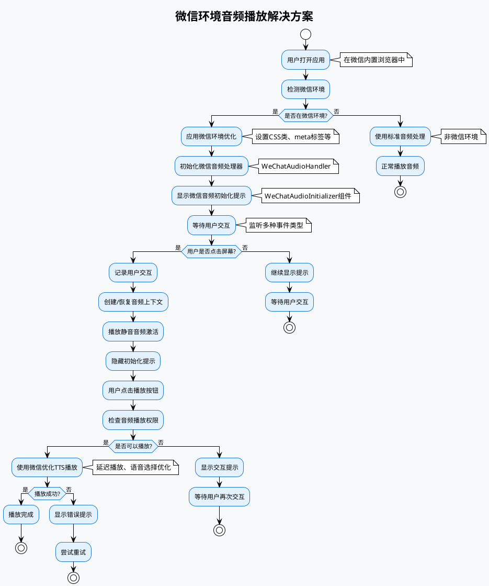

# 微信环境音频播放解决方案

## 问题描述

在微信内置浏览器中，由于安全限制，音频播放需要用户主动交互才能启用。这导致应用在微信中无法正常播放音频。

## 解决方案

### 1. 微信环境检测

通过检测 `navigator.userAgent` 中的 `micromessenger` 标识来识别微信环境：

```typescript
const isWeChat = navigator.userAgent.toLowerCase().includes("micromessenger");
```

### 2. 用户交互检测

微信环境需要更积极的用户交互检测，监听多种事件类型：

```typescript
const events = [
  "touchstart",
  "touchend",
  "mousedown",
  "mouseup",
  "click",
  "keydown",
  "keyup",
  "focus",
  "blur",
  "scroll",
  "resize",
  "orientationchange",
];
```

### 3. 音频上下文管理

- 创建音频上下文时使用捕获阶段监听事件
- 实现音频上下文的暂停和恢复机制
- 播放静音音频来激活音频上下文

### 4. 微信环境优化

- 设置微信环境特定的 CSS 类
- 添加微信环境特定的 meta 标签
- 应用微信环境特定的样式

## 核心组件

### WeChatAudioHandler

专门处理微信环境的音频播放：

```typescript
// 检测微信环境
isWeChatEnvironment(): boolean

// 检查是否可以播放音频
canPlayAudio(): boolean

// 播放TTS音频（微信环境优化）
playTTS(text: string, options: AudioOptions): Promise<void>

// 播放音效（微信环境优化）
playSound(frequency: number, duration: number): Promise<void>
```

### WeChatAudioInitializer

微信环境音频初始化组件：

- 显示微信环境专用提示
- 引导用户进行交互
- 提供强制启用选项
- 显示设备信息和状态

### WeChatOptimizer

微信环境优化工具：

- 检测微信版本
- 提供微信环境优化配置
- 应用微信环境特定的样式
- 提供功能支持检测

## 使用方法

### 1. 自动检测和优化

应用启动时会自动检测微信环境并应用优化：

```typescript
useEffect(() => {
  wechatOptimizer.applyWeChatOptimizations();
}, []);
```

### 2. 音频播放

在微信环境中，音频播放会自动使用微信优化的处理器：

```typescript
// 在AudioPlayer组件中
if (isWeChat) {
  await wechatAudioHandler.playTTS(text, options);
} else {
  // 使用标准音频处理
}
```

### 3. 测试和调试

通过设置面板可以访问微信环境音频测试工具：

- 检测微信环境
- 测试音频功能
- 查看设备信息
- 调试音频问题

## 流程图



## 技术特点

### 1. 自动检测

- 自动检测微信环境
- 自动应用相应的优化策略
- 无需手动配置

### 2. 用户友好

- 清晰的提示信息
- 引导用户进行必要的交互
- 提供多种启用方式

### 3. 兼容性好

- 支持不同版本的微信
- 兼容不同的设备类型
- 提供降级方案

### 4. 调试支持

- 详细的调试信息
- 测试工具
- 错误提示

## 注意事项

1. **用户交互要求**：微信环境必须要有用户交互才能播放音频
2. **音频上下文管理**：需要正确处理音频上下文的创建和恢复
3. **事件监听**：使用捕获阶段监听事件确保事件被处理
4. **延迟播放**：微信环境需要适当的延迟来确保音频正常播放
5. **错误处理**：提供友好的错误提示和重试机制

## 测试方法

1. 在微信中打开应用
2. 查看是否显示微信环境音频初始化提示
3. 点击屏幕任意位置
4. 尝试播放音频
5. 使用设置面板中的测试工具进行详细测试

## 故障排除

### 问题：音频无法播放

- 检查是否在微信环境中
- 确认用户是否进行了交互
- 查看控制台错误信息
- 使用测试工具进行诊断

### 问题：提示不显示

- 检查微信环境检测是否正确
- 确认组件是否正确渲染
- 查看设备信息

### 问题：音频播放延迟

- 这是微信环境的正常现象
- 可以调整延迟时间
- 使用预加载优化

## 更新日志

- v1.0.0: 初始版本，支持微信环境音频播放
- 添加微信环境检测
- 实现用户交互检测
- 创建微信音频处理器
- 添加测试和调试工具
